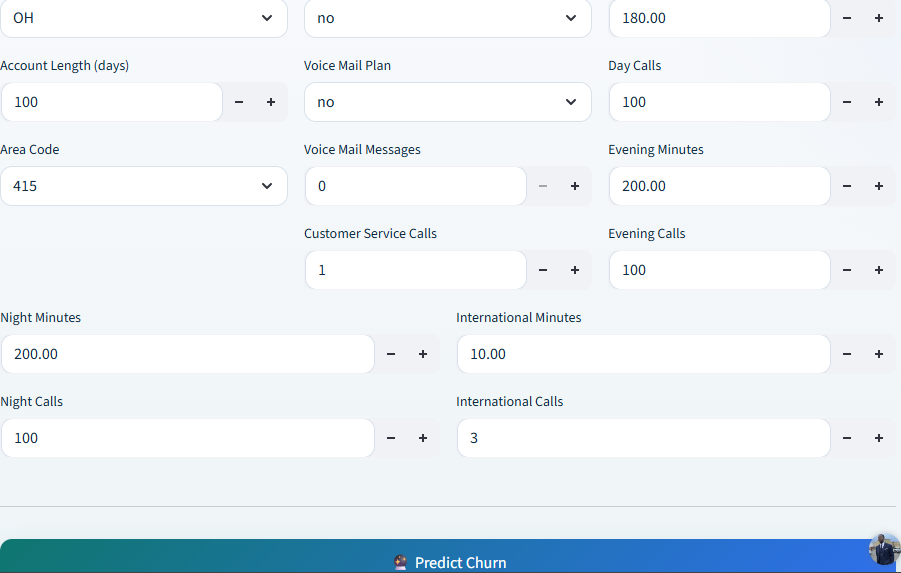
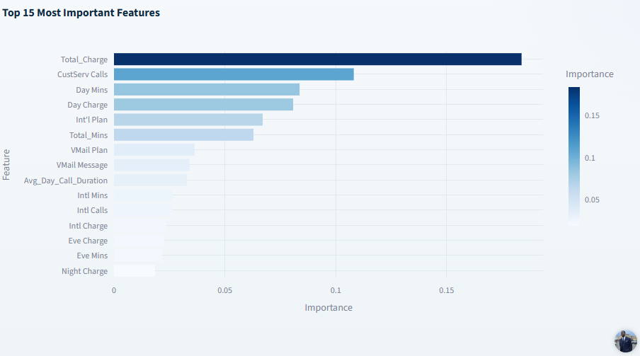
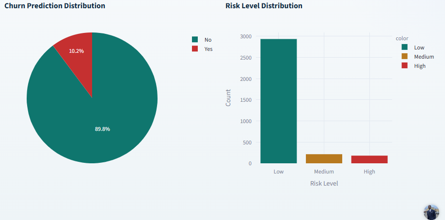

  # 🤖 Customer Churn Prediction-Analytics

🚀 **Featured Project: End-to-End Customer Churn Prediction, Retention Analytics, and Product Decision Support**

**Live App:** https://denis0242-customer-churn-app-bfp0q8.streamlit.app  

**GitHub:**[Customer Churn Prediction-Analytics](https://github.com/Denis0242/Customer-Churn)

---

## Overview

This project simulates a real-world Product Data Analyst workflow for churn reduction, combining user behavior analysis, predictive modeling, and retention strategy design.

The goal is not just to predict churn, but to enable **data-driven product decisions** that improve user retention.

---

## Business Problem

User churn is one of the most critical product challenges.  

High churn reduces:
- retention
- lifetime value (LTV)
- product growth

**Objective:**  
Identify high-risk users and design strategies to improve retention.

---

## Key Metrics

- Churn Rate  
- Retention Rate  
- Lifetime Value (LTV)  
- User Engagement Metrics  

---

## Approach

### 1. Data Exploration
- Analyzed user activity, tenure, and usage patterns  
- Identified behavioral differences between churned and retained users  

### 2. Feature Engineering
- Created engagement-based features  
- Derived usage frequency and activity indicators  

### 3. Predictive Modeling
- Built classification model (~82% ROC-AUC)  
- Identified high-risk churn segments  

### 4. Insight Generation
Key churn drivers:
- Low engagement frequency  
- Short tenure  
- Reduced product interaction  

---

## Product Insights

- Users with low engagement are significantly more likely to churn  
- Early-stage user experience strongly impacts retention  
- Behavioral signals can be used for proactive intervention  

---

## Product Recommendations

- Improve onboarding experience to reduce early churn  
- Introduce engagement triggers for inactive users  
- Target high-risk users with personalized retention strategies  

---

## Business Impact

- Identified high-risk users for targeted intervention  
- Enabled retention strategies projected to improve retention by ~8%  
- Improved decision-making for retention-focused product initiatives  

---

## Decision Framework

This system supports product teams in deciding:

- Which users to target  
- When to intervene  
- What retention strategies to apply  

---
### Churn Prediction Distribution

Displays predicted churn probabilities across users.

---

### Feature Importance

Highlights key factors influencing churn predictions.

---
###  Distribution

Segments users into high/low churn categories for targeted retention strategies.

---

# 📁 Project Structure
Customer-Churn/
  ├── app.py
  ├── requirements.txt
  ├── README.md
  ├── data/
  └── models/

----

## Tech Stack

- Python (Pandas, Scikit-learn)  
- Streamlit  
- SQL  
- Plotly  

---

## Key Takeaway

This project demonstrates how churn prediction can move beyond modeling into **actionable product strategy and decision-making**.

----

## 📌 Author

**Denis Agyapong**  

